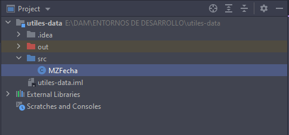
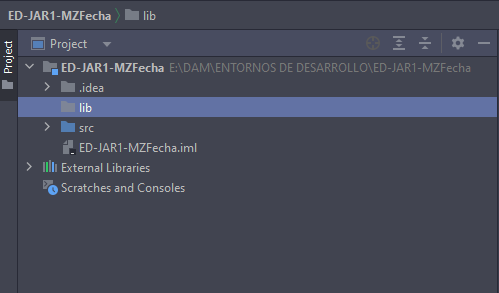
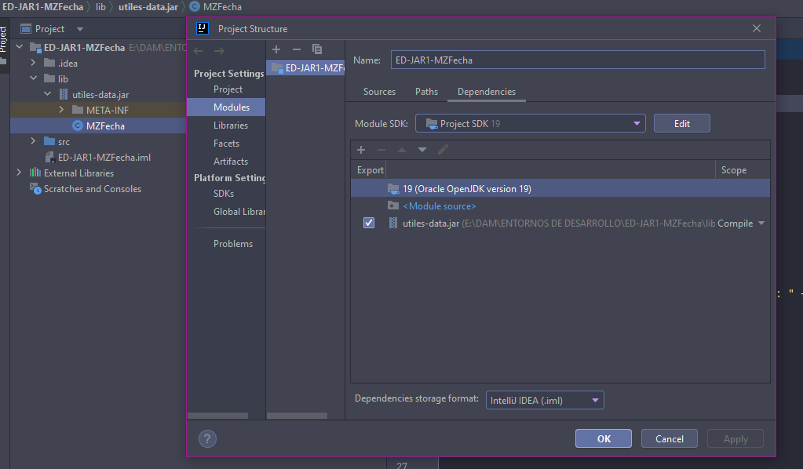

<h6 style="text-align: right"> <em> Raquel Guerrero Perucho </em> </h6> 
<h6 style="text-align: right"> <em> 1º DAM - Entornos de desarrollo </em> </h6> 

# TEMA 1: Práctica 1 
> ### PARTE A:

Creamos un nuevo proyecto con el nombre utiles-data con el fichero MZFecha.java 

Exportación del fichero a un fichero JAR con el nombre de utiles-data.jar.

> ### PARTE B:

Nuevo proyecto en INTELLIJ con el nombre de ED-JAR1-MZFecha y  una carpeta denominada lib dentro.

Fichero utiles-data.jar copiado dentro del directorio lib con el JAR añadido.

Clase Principal creada que utilice la clase MZFecha, en la que:

Muestre un menú para provar las opciones de la clase MZFecha:

• establecer fecha.

• imprimir fecha.

• Diferència entre dos fechas.

